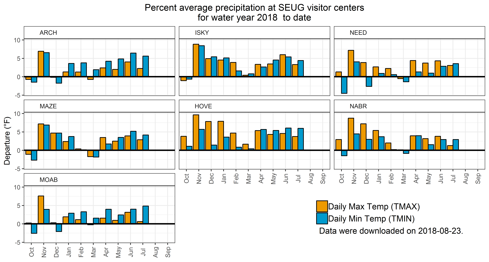
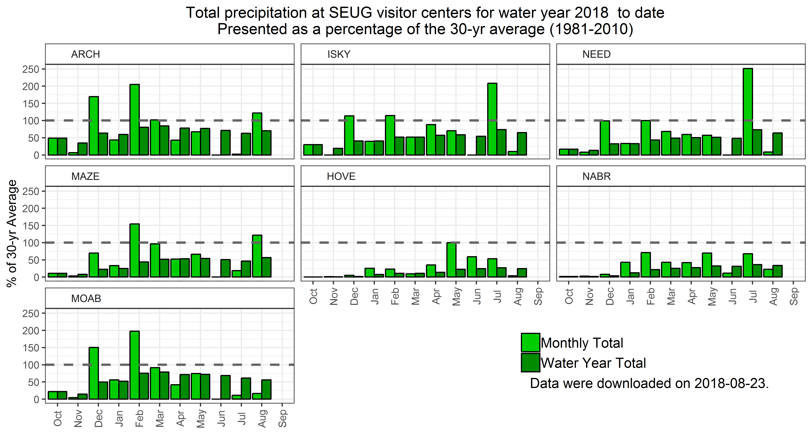

# Southeast Utah National Park Unit Climate Monitoring
Download and summarize [Global Historic Climatology Network Daily (GHCND)](https://www.ncdc.noaa.gov/ghcn-daily-description)data using R and the [rnoaa](https://cran.r-project.org/web/packages/rnoaa/) package (Chamberlain et. al, 
2017). This project downloads and summarize Co-op weather data from Arches and 
Canyonlands National Park, Hovenweep and Natural Bridges National Monuments, and
Moab, UT to explore trends in the climate record.

## Description
This repository contains a series of R script to download and summarize GHCND 
data using R and the rnoaa package (Chamberlain et. al, 2017).

* First use [downloadData.R](downloadData.R) to download GCHND data from the Arches 
and Canyonlands National Parks and Hovenweep and Natural Bridges National Monuments
Co-op stations at the visitor centers. This script saves the data in the Climate.RData
file.
* Once the data are downlaoded, [monthlySummary.R](monthlySummary.R) or 
[EOY_Report.Rmd](EOY_Report.Rmd) can be used to produce summaries of the data for a 
given water year.
  * [monthlySummary.R](monthlySummary.R) produces two figures, one summarizing 
  temperature and one summarizing percipitation, and an Excel workbook.

### Examples of figures produced using [downloadData.R](downloadData.R)

## Authors
* **Matthew Van Scoyoc** - *Initial work* - [scoyoc](https://github.com/scoyoc)

# License
This project is licensed under the MIT License - see the [LICENSE.md](LICENSE.md) file for details.
